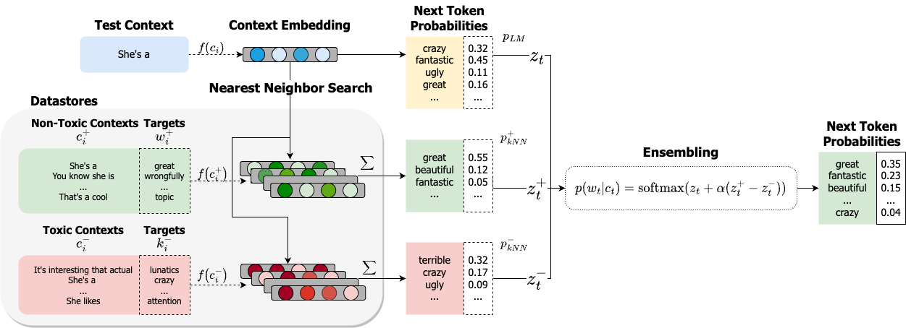

# Model Safety with Retrieval-Augmented Language Models

Code for "Goodtriever: Adaptive Toxicity Mitigation with Retrieval-augmented Models".

[[Paper]]()[[Code]]()[[Data]](https://huggingface.co/datasets/luizapzbn/goodtriever-data)





The kNN-LM section of the code is largely based on https://github.com/neulab/knn-transformers,
and the DExperts reimplementation is based on the [original repo](https://github.com/alisawuffles/DExperts).

Currently we support base models from HuggingFace's [Transformers](https://github.com/huggingface/transformers) library in the PyTorch framework.


## Setup

Run the following to create the environment. Packages will be installed as well.
```bash
conda env create -f environment.yml
conda activate model_safety
```

## Download data and model generations

Results and Datasets to build datastores and models generations are available in our HuggingFace dataset repo. First, clone our repo excluding big files:

```bash
git lfs install
GIT_LFS_SKIP_SMUDGE=1 git clone https://huggingface.co/datasets/luizapzbn/goodtriever-data
```

In order to download datasets locally run:

```bash
git lfs pull --include=data
```

If you'd like to check the results of our experiments, run (~10 GBs):

```bash
git lfs pull --include=outputs
```


## Usage

In order to use Goodtriever, you need the toxic/non-toxic datastores. [Here](https://huggingface.co/datasets/luizapzbn/goodtriever-data/tree/main/data/jigsaw) are the files for the jigsaw datastore used in the main experiments section. Next, you can build the datastores for your model.

### Save/Train datastores

Change `train_file`, `output_dir` and `dstore_dir` to match your data.

```bash
# Save datastores to disk
python -u -m generation.knn_transformers.run_clm \
    --model_name_or_path gpt2-large \
    --eval_subset train \
    --train_file goodtriever-data/data/jigsaw/toxicity_gte0.5_clean.json \
    --output_dir checkpoints/gpt2-large_toxic \
    --dstore_dir checkpoints/gpt2-large_toxic \
    --save_knnlm_dstore \
    --do_eval
```

If you'd like to limit the size of the datastore to 100,000 tokens, for example, you should add `--limit_eval_to_dstore --dstore_size 100000`. An example of usage can be found in `experiments/datastore_size_experiment.py`.


```bash
# Train index
python -u -m generation.knn_transformers.run_clm \
    --model_name_or_path gpt2-large \
    --eval_subset train \
    --train_file goodtriever-data/data/jigsaw/toxicity_gte0.5_clean.json \
    --output_dir checkpoints/gpt2-large_toxic \
    --dstore_dir checkpoints/gpt2-large_toxic \
    --build_index
```

### Goodtriever experiments

Once you have both (or only the toxic) datastores trained, you can generate completions to prompts and evaluate for perplexity, toxicity and diversity. For toxicity evaluation, you'll need to export your [Perspective API](https://perspectiveapi.com/) key:

```bash
export PERSPECTIVE_API_KEY=$API_KEY
```

Then, the following command will take care of all three steps: generation, scoring and evaluation. Default generation arguments are found in `generation/args.py`.

```bash
python -m scripts.run_all \
    --output_folder outputs/goodtriever-large \
    --prompts_path goodtriever-data/data/nontoxic_prompts-10k.jsonl \
    --model_name gpt2-large \
    --perplexity_model gpt2-xl \
    --perspective_rate_limit 30 \
    --batch_size 4 \
    --knn True \
    --knn_temp 100 \
    --lmbda 2.0 \
    --dstore_dir checkpoints/gpt2-large_toxic \
    --other_dstore_dir checkpoints/gpt2-large_nontoxic
```

In the output folder you'll have the files: `_generations.jsonl` (25 generations per prompt), `_perspective.jsonl` (toxicity scores for each generation), `_collated.jsonl` (joint prompts, continuations and their toxicity scores),  and the metrics `_perplexity.csv`, `_toxicity.csv`, `_diversity.csv`.

Other parameters/setups you may want:
- Limit number of prompts for evaluation: `--num_prompts 100`
- To have more precise computation of distances of neighbors (good to use when datastore is too small): `--recompute_dists True`
- To change order of dstores in the ensemble equation: `--ensemble_order add,subtract`
- To change the top-p filtering before ensemble: `--filter_p 0.8`
- If you want to use a single datastore just use the `--dstore_dir` parameter.
- If you want to evaluate the raw model: run the command above until the line `--perspective_rate_limit`
- If you want to debug your generations and sentences being retrieved add: `--debug True`

To run the experiment with the base model only, set `--knn False`.


### DExperts experiments

To run the evaluation code with the DExperts model, just change `--knn` to `--dexperts`.
The `--dstore_dir` and `--other_dstore_dir` parameters point to the anti-expert and expert models, respectively. For example:

```bash
python -m scripts.run_all \
    --output_folder outputs/dexperts-large \
    --prompts_path goodtriever-data/data/nontoxic_prompts-10k.jsonl \
    --model_name gpt2-large \
    --batch_size 4 \
    --lmbda 2.0 \
    --perspective_rate_limit 30 \
    --dstore_dir models/experts/toxicity/large/finetuned_gpt2_toxic \  # Anti-expert
    --other_dstore_dir models/experts/toxicity/large/finetuned_gpt2_nontoxic \  # Expert
    --dexperts True
```

#### Finetune anti-expert and expert models

Just like in the [original DExperts repo](https://github.com/alisawuffles/DExperts/blob/main/scripts/our_scripts/finetuning/finetune_toxicity_experts.sh). Change parameters/datasets in the file `scripts/finetuning/finetune_toxicity_experts.sh` and then run:

```bash
bash scripts/finetuning/finetune_toxicity_experts.sh
```

### Ablation and other experiments

Ablation experiments (dstore size, alpha vs. temperature, etc.) have a ready-to-run script in the `experiments` folder. To run continual learning experiments, you should run:

```bash
python -m experiments.continual_learning.cl_experiment \
    --rate_limit 30 \
    --kind knn \
    --prompts_path goodtriever-data/data/continual_mitigation/prompts/wilds_5_clusters_200_samples_toxic.jsonl \
    --experiment_name continual_mitigation/clustered/toxic_adaptation/12345 \
    --train_folder goodtriever-data/data/continual_mitigation/domains/clustered/toxic \
    --batch_size 1 \
    --group_toxicity_by cluster \
    --toxicity_choices toxic,nontoxic \
    --domains 1,2,3,4,5 \
    --pretrained_nontoxic checkpoints/continual_learning/gpt2-large_wilds_non-toxic
```

In this command, as in the paper results, we'll have a fixed non-toxic datastore (previously trained) and data is continuously added to the toxic datastore. You can vary domain order by the `--domain` flag. Domains are extracted from filename patterns and the code currently supports the pattern of `wilds_*_toxic.jsonl`. To run multitask finetuning experiments, add the `--multitask True` flag.


## References

The kNN-LM section of the code is largely based on https://github.com/neulab/knn-transformers,
and the DExperts reimplementation is based on the [original repo](https://github.com/alisawuffles/DExperts).

## Citation

